# Arsitektur Sistem & Flowchart per Fungsi
### TTP Mapping PoC — CTI → MITRE ATT&CK (Local LLM / LM Studio)

Dokumen ini terdiri dari dua bagian:

1. **Arsitektur keseluruhan** — dijelaskan dalam bentuk teks.
2. **Flowchart tiap fungsi** — ditulis sebagai diagram Mermaid (teks) yang akan ter-render otomatis di viewer Markdown.

---

## BAGIAN 1 — ARSITEKTUR KESELURUHAN (TEKS)

### 1.1 Tujuan sistem
Memetakan laporan **Cyber Threat Intelligence (CTI)** ke framework **MITRE ATT&CK**. Untuk tiap laporan, sistem mengidentifikasi **Tactics (TA####)** dan **Techniques (T####/T####.###)** yang sesuai dengan perilaku attacker, lalu membungkus hasilnya menjadi **STIX 2.1 bundle** dan dievaluasi (Precision/Recall/F1) terhadap label ground-truth dataset TRAM II.

### 1.2 Komponen utama (per modul `src/`)
- **`data_loader.py`** — Lapisan input. Membaca dataset TRAM II (`.json`/`.mjson`), mengekstrak teks + label teknik ground-truth, dan otomatis mengonversi PDF → JSON sebelum dibaca.
- **`attck_loader.py`** — Knowledge base. Mem-parsing file MITRE CTI (`enterprise-attack.json`) menjadi dictionary teknik (`{T#### : {name, description, tactics, ...}}`) dan taktik (`{TA#### : nama}`).
- **`tactic_agent.py`** — Agen LLM #1. Memetakan teks → daftar **tactic ID**. Berisi klien OpenAI-compatible ke LM Studio, retry/fallback, structured JSON output, dan parser fallback.
- **`technique_agent.py`** — Agen LLM #2. Memetakan teks → daftar **technique ID**. Tambahannya: **retrieval kandidat** (TF-IDF + cosine similarity) untuk mempersempit ~750 teknik menjadi top-K, dan **chunking** teks panjang.
- **`reviewer_agent.py`** — Agen LLM #3 (opsional, opt-in). Menilai konsistensi tactic+technique terhadap teks; jika tidak konsisten memberi feedback untuk revisi (loop "debat" multi-agent).
- **`reconciler.py`** — Logika non-LLM. Menyaring teknik agar taktiknya konsisten dengan taktik teridentifikasi, dedup, dengan safety-net agar recall tidak hilang.
- **`validator.py`** — Memverifikasi tiap technique ID benar-benar ada di knowledge base.
- **`stix_builder.py`** — Mengonversi teknik final → STIX 2.1 bundle (objek AttackPattern).
- **`orchestrator.py`** — **Otak pipeline**, dibangun di atas **LangGraph** (`StateGraph`). Merangkai semua node: input → tactic → technique → review → (revisi?) → post-process.
- **`evaluator.py`** — Menghitung metrik micro Precision/Recall/F1 (mode exact & base-technique), menurunkan ground-truth taktik dari teknik, menyimpan hasil.
- **`evidence.py`** — Mencari "kalimat rujukan" (evidence) tiap mapping via TF-IDF (tanpa LLM), untuk ditampilkan di laporan PDF.
- **`report_builder.py`** — Membangun laporan **PDF** (ReportLab).
- **`build_excel_report.py`** — Membangun laporan **Excel** 4-sheet (openpyxl): ringkasan, per laporan, taktik per laporan, distribusi taktik.
- **`web_app.py`** — REST API **FastAPI**: upload laporan → proses async (thread) → review/validasi analis → unduh PDF.
- **`pdf_to_json_converter.py`** — CLI mandiri PDF → JSON.
- **`evaluate_run.py` / `run_full_pipeline.py`** — Harness/entry-point batch evaluasi.
- **`main.py`** — Entry-point utama (memproses subset 5 laporan untuk demo).

### 1.3 Alur data end-to-end (runtime)
```
data/tram_ii/*.{json,mjson,pdf}                 data/mitre_cti/enterprise-attack.json
            │                                                   │
   load_tram_dataset()                              load_attck_techniques()/_tactics()
            │  (list report: id, text, techniques GT)           │ (KB teknik & taktik)
            └───────────────────────────┬───────────────────────┘
                                        ▼
                           process_report()  ── LangGraph pipeline ──┐
                                        ▼                            │
        input_report → tactic_extraction → technique_extraction → review
                                        │                            │
                                        │   (review_is_valid? & iter<max)
                                        │           ├─ tidak valid → kembali ke tactic_extraction (revisi)
                                        │           └─ valid/max   → post_process
                                        ▼
                  post_process: reconcile → validate → build_stix_bundle
                                        ▼
                  {predicted_techniques, tactics_identified, stix_bundle}
                                        ▼
         evaluate_predictions() ── metrik ──▶ save_results() / Excel / PDF
```

### 1.4 Pola desain yang dipakai
- **Agentic / multi-agent**: tiga agen LLM terpisah (tactic, technique, reviewer) dengan tanggung jawab berbeda; reviewer membentuk loop revisi (debat).
- **Orkestrasi graph (LangGraph)**: state bersama (`PipelineState` TypedDict) mengalir antar-node; ada **conditional edge** (`_should_revise`) untuk looping revisi terbatas.
- **Retrieval-augmented**: TF-IDF mempersempit kandidat teknik agar muat di context window model kecil (n_ctx ~4096).
- **Robustness LLM**: structured JSON schema + multi-layer fallback parser (regex), retry exponential backoff, fallback model, strip blok `<think>`.
- **Separation of concerns**: input, KB, agen, logika rekonsiliasi/validasi, output (STIX/PDF/Excel), dan API terpisah rapi.

### 1.5 Konfigurasi penting (ENV)
`LLM_PROVIDER`, `LOCAL_LLM_BASE_URL`, `LOCAL_LLM_MODEL`, `LOCAL_LLM_FALLBACK_MODEL`, `REVIEWER_ENABLE`, `LLM_REVIEW_MAX_ITER`, `LLM_DISABLE_THINKING`, `LLM_STRUCTURED_OUTPUT`, `TECHNIQUE_CANDIDATE_TOP_K`, `LOCAL_LLM_REPORT_MAX_CHARS`, `ATTCK_SOURCE`.

---

## BAGIAN 2 — FLOWCHART TIAP FUNGSI

> Catatan: fungsi sangat trivial (getter/style/helper satu baris) diringkas di akhir tiap modul; fungsi dengan percabangan/loop digambar penuh.

### 2.1 `main.py`

#### `validate_setup()`
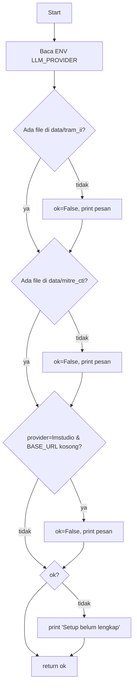

#### `main()`
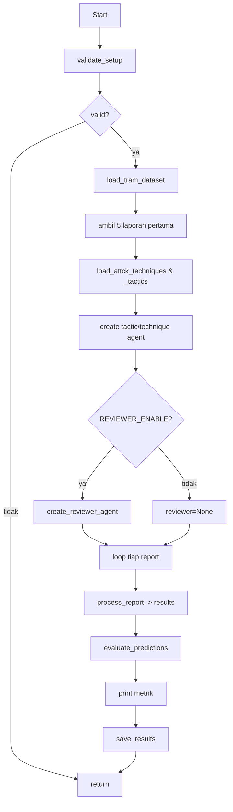

### 2.2 `data_loader.py`

#### `_extract_text_from_pdf(pdf_path)`
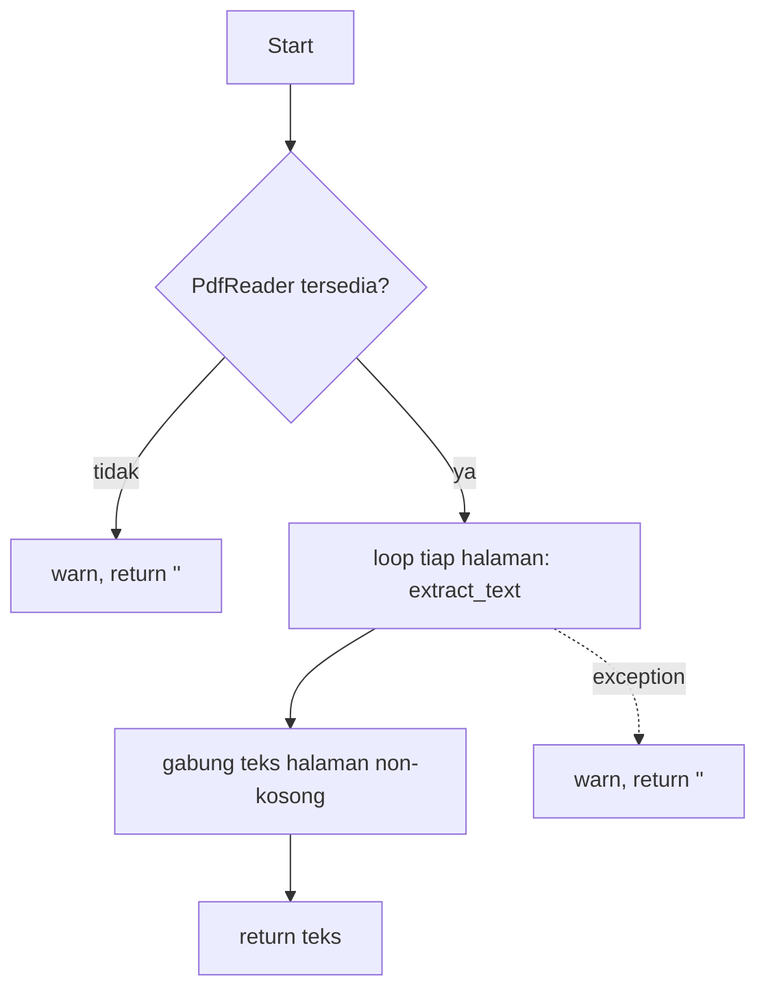

#### `_convert_pdf_to_json(pdf_path, output_path)`
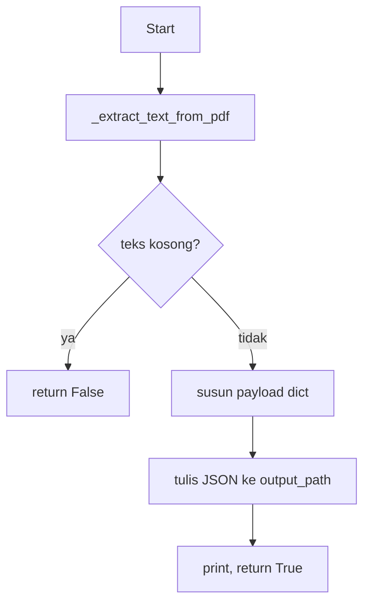

#### `_auto_convert_pdfs_to_json(data_path)`
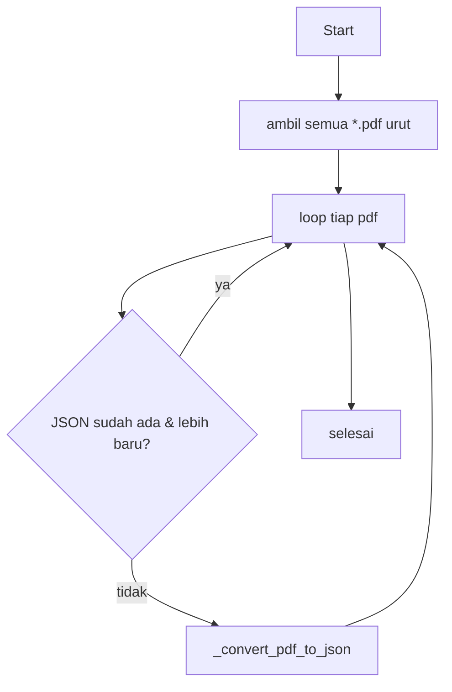

#### `_extract_text_from_report(data)`
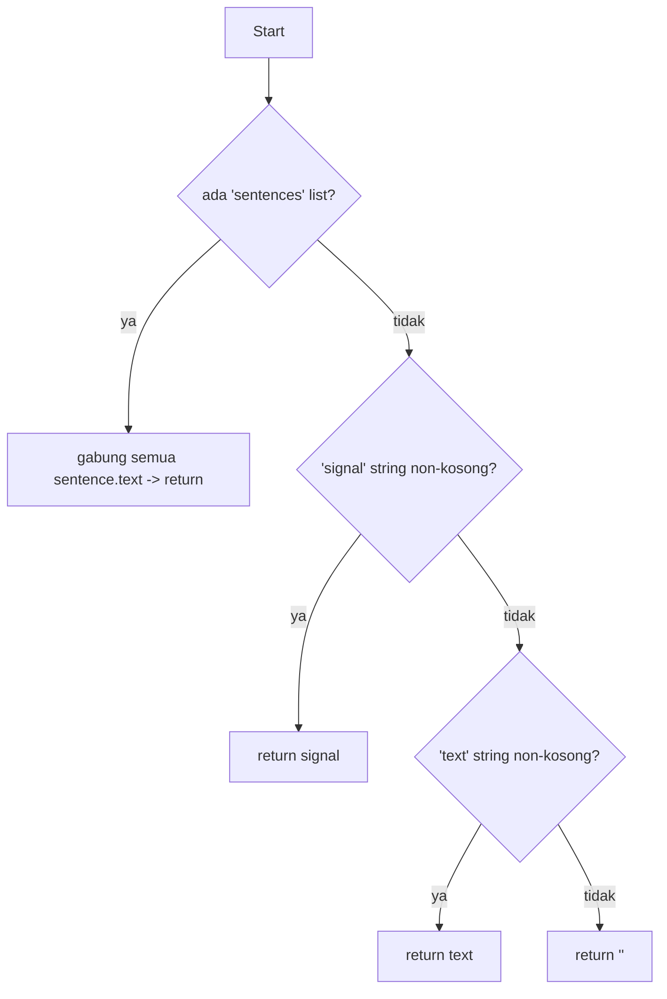

#### `_extract_techniques_from_report(data)`
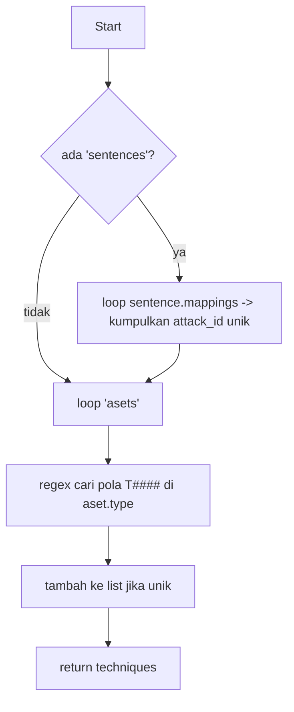

#### `load_tram_dataset(data_dir)`
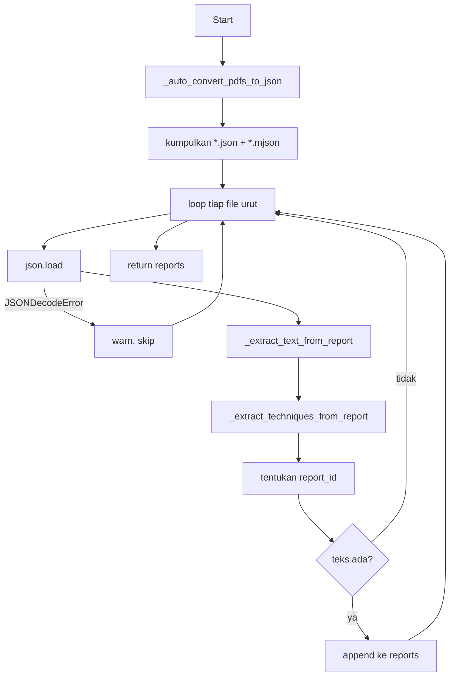

#### `split_dataset(reports, test_ratio)`
```mermaid
flowchart TD
    A[Start] --> B[split_idx = len * (1-ratio)]
    B --> C[train = sebelum idx, test = sesudah idx]
    C --> D[return train, test]
```

### 2.3 `attck_loader.py`

#### `_iter_attck_files(attck_source)`
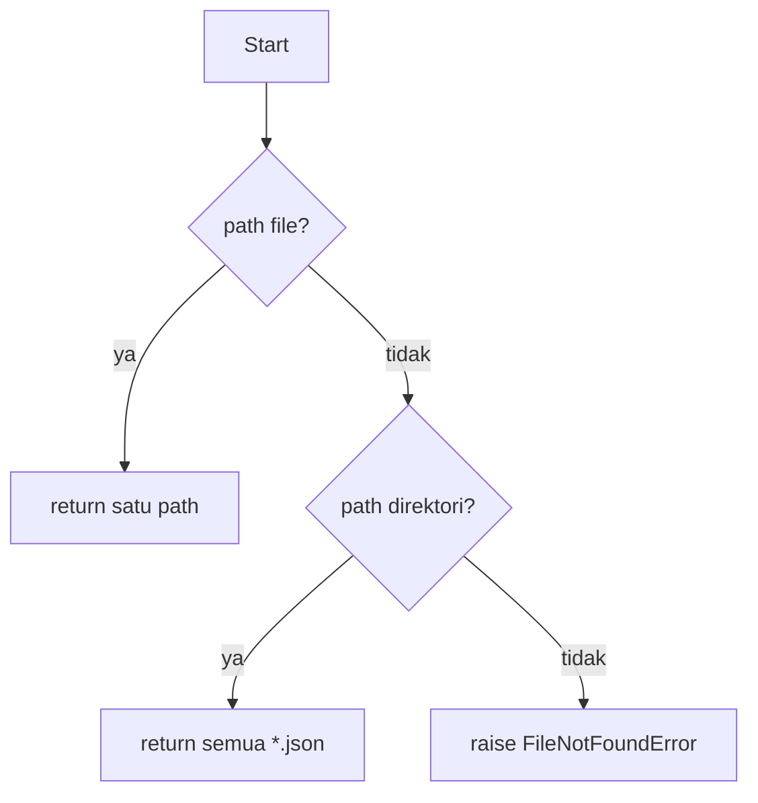

#### `load_attck_techniques(attck_source)`
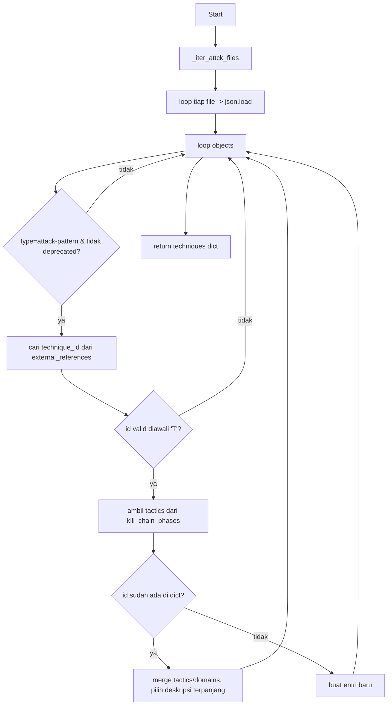

#### `load_attck_tactics(attck_source)`
```mermaid
flowchart TD
    A[Start] --> B[_iter_attck_files]
    B --> C[loop file -> json.load -> loop objects]
    C --> D{type=x-mitre-tactic & tidak deprecated?}
    D -- tidak --> C
    D -- ya --> E[cari tactic_id diawali 'TA']
    E --> F{ada id?}
    F -- tidak --> C
    F -- ya --> G[tactics[id]=name]
    G --> C
    C --> H[return dict terurut]
```

#### `_get_domain_from_source(...)` & `get_technique_names(...)`
Helper sederhana: yang pertama mengembalikan domain (`x_mitre_domains[0]` atau dari nama file), yang kedua memetakan `{id: name}` dari dict teknik. Tanpa percabangan kompleks.

### 2.4 `tactic_agent.py`

#### `create_tactic_agent()`
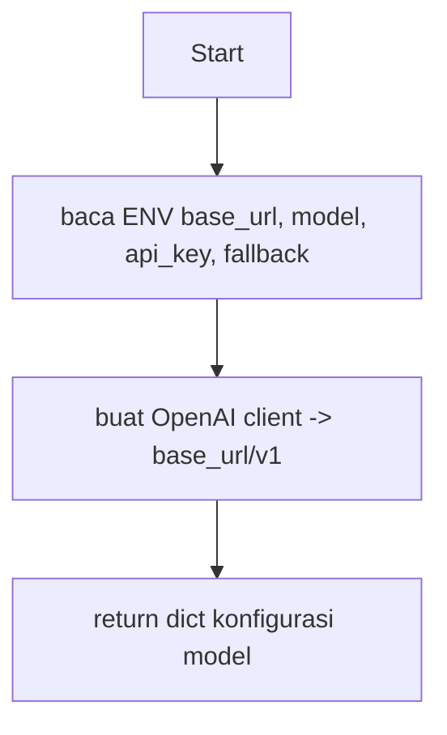

#### `_complete_chat(...)` (dipakai juga di technique/reviewer dgn pola sama)
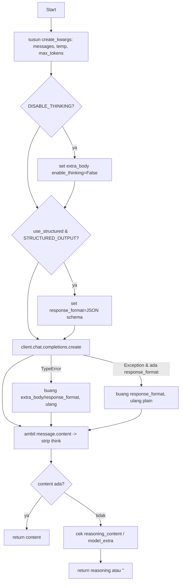

#### `_extract_json_array(response_text)`
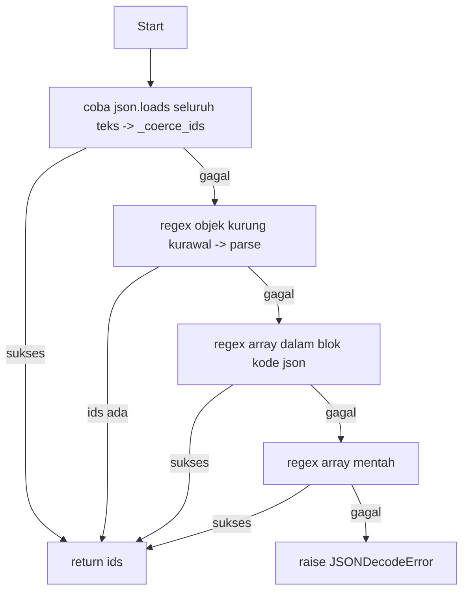

#### `_extract_tactic_ids_from_text(text, tactic_list)` (parser fallback)
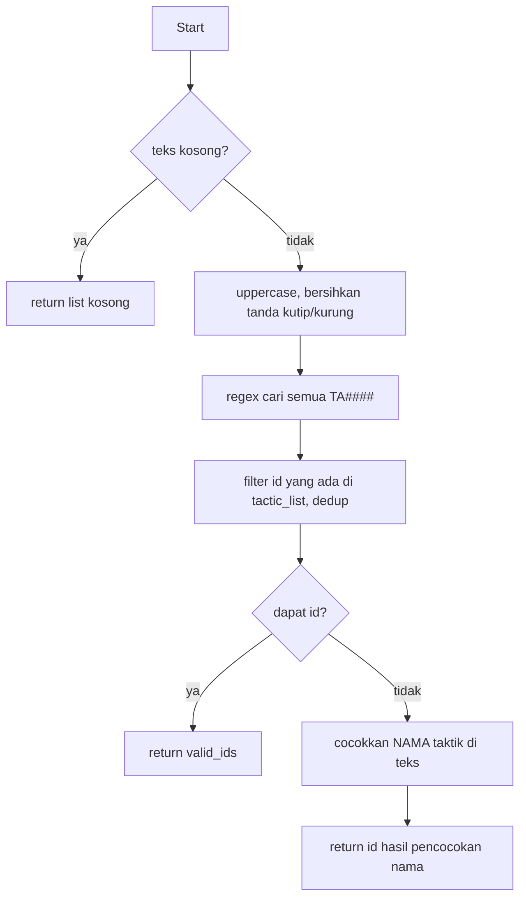

#### `identify_tactics(model, report_text, tactic_list, reviewer_feedback)`
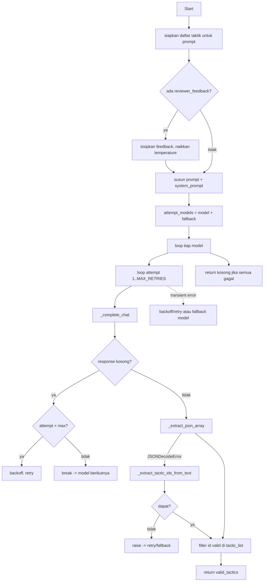

#### Helper kecil: `_is_transient_error`, `_strip_think_blocks`, `_coerce_ids`
- `_is_transient_error`: cek apakah string error mengandung marker transient (timeout, 429, 503, connection reset, dll) → bool.
- `_strip_think_blocks`: regex buang blok `<think>...</think>` → teks bersih.
- `_coerce_ids`: jika list → kembalikan; jika dict → ambil key `ids/tactics/...` → list.

### 2.5 `technique_agent.py`
Banyak helper identik dengan `tactic_agent.py` (`_complete_chat`, `_extract_json_array`, `_coerce_ids`, `_is_transient_error`, `_strip_think_blocks`, `create_technique_agent`, `_extract_technique_ids_from_text`) — lihat pola yang sama di §2.4. Yang khas modul ini:

#### `_chunk_text(text, chunk_size, overlap, max_chunks)`
```mermaid
flowchart TD
    A[Start] --> B{len(text) <= chunk_size?}
    B -- ya --> B1[return satu chunk]
    B -- tidak --> C[step = chunk_size - overlap]
    C --> D[loop: potong text per window]
    D --> E{start<len & jml<max_chunks?}
    E -- ya --> D
    E -- tidak --> F[return chunks]
```

#### `_build_technique_document(id, data)`
Helper: gabung `"{id} {name}. {desc[:800]} {tactics}"` menjadi satu dokumen teks untuk TF-IDF.

#### `_retrieve_candidate_techniques(report_text, attck_techniques, top_k, ...)`
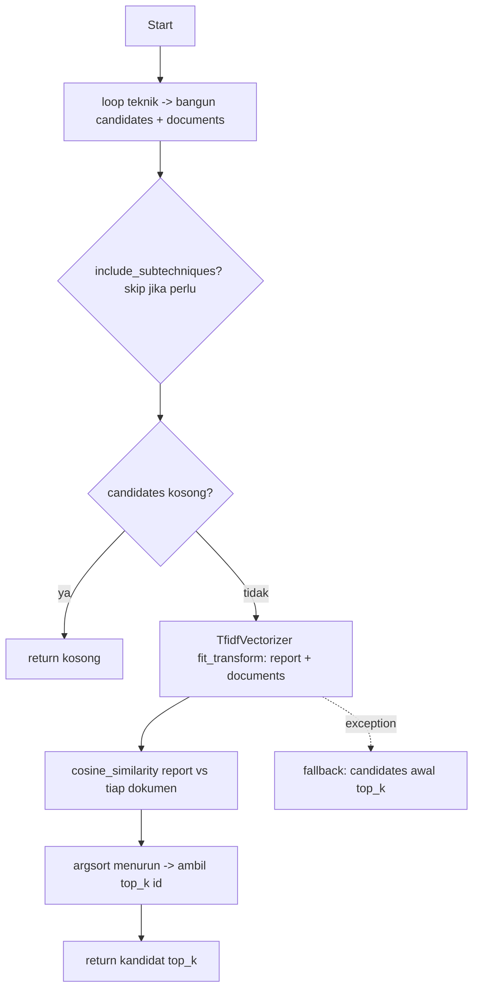

#### `extract_techniques(model, report_text, attck_techniques, top_k, reviewer_feedback)`
```mermaid
flowchart TD
    A[Start] --> B[top_k = min(top_k, CANDIDATE_TOP_K)]
    B --> C{ada reviewer_feedback?}
    C -- ya --> C1[sisip feedback, naikkan temperature]
    C -- tidak --> D[_retrieve_candidate_techniques]
    C1 --> D
    D --> E{kandidat kosong?}
    E -- ya --> E1[return kosong]
    E -- tidak --> F[format daftar kandidat sesuai budget char]
    F --> G[_chunk_text -> beberapa chunk]
    G --> H[loop tiap chunk]
    H --> I[susun prompt + _llm_extract_ids]
    I --> J[union id baru ke aggregated]
    J --> H
    H --> K[return aggregated]
```

#### `_llm_extract_ids(model, system_prompt, prompt, max_tokens, attck_techniques, temperature)`
```mermaid
flowchart TD
    A[Start] --> B[attempt_models = model + fallback]
    B --> C[loop model -> loop attempt 1..MAX]
    C --> D[_complete_chat]
    D --> E{response kosong?}
    E -- ya --> E1[backoff/retry atau pindah model]
    E -- tidak --> F[_extract_json_array]
    F -- JSONDecodeError --> F1[_extract_technique_ids_from_text]
    F1 --> G{dapat?}
    G -- tidak --> G1[raise -> retry/fallback]
    F --> H[filter id ada di attck_techniques]
    G -- ya --> H
    H --> I[return list teknik valid]
    C -. transient .-> J[backoff/retry/fallback]
    C --> K[return kosong jika semua gagal]
```

### 2.6 `reviewer_agent.py`
Helper (`_complete_chat`, `_is_transient_error`, `_strip_think_blocks`, `create_reviewer_agent`) sepola §2.4. Yang khas:

#### `_extract_json_object(response_text)`
```mermaid
flowchart TD
    A[Start] --> B[regex objek dalam blok kode json]
    B -- sukses --> Z[return dict]
    B -- gagal --> C[regex objek kurung kurawal mentah -> parse]
    C -- sukses --> Z
    C -- gagal --> D[raise JSONDecodeError]
```

#### `_fallback_review_parse(response_text)`
```mermaid
flowchart TD
    A[Start] --> B{teks kosong?}
    B -- ya --> B1[return None]
    B -- tidak --> C[regex 'is_valid: true/false']
    C -- ketemu --> D[set is_valid]
    C -- tidak --> E[cek kata 'inconsistent/invalid' vs 'consistent/valid']
    E -- tak jelas --> E1[return None]
    E --> D
    D --> F[regex ambil 'feedback: ...']
    F --> G[return is_valid + feedback]
```

#### `review_tactics_and_techniques(model, report_text, tactics, techniques, attck_tactics, attck_techniques)`
```mermaid
flowchart TD
    A[Start] --> B[susun ringkasan tactics & techniques]
    B --> C[susun prompt reviewer + system_prompt]
    C --> D[attempt_models = model + fallback]
    D --> E[loop model -> loop attempt]
    E --> F[_complete_chat]
    F --> G{response kosong?}
    G -- ya --> G1[backoff/retry/fallback atau return is_valid=False]
    G -- tidak --> H[_extract_json_object]
    H -- sukses --> I[return is_valid + feedback]
    H -- JSONDecodeError --> J[_fallback_review_parse]
    J -- ada hasil --> I
    J -- None --> K[raise -> retry/fallback]
    E -. transient .-> L[backoff/retry/fallback]
    E --> M[return is_valid=False jika gagal total]
```

### 2.7 `orchestrator.py` (LangGraph pipeline)

#### `_input_report_node(state)`
```mermaid
flowchart TD
    A[Start] --> B[ambil report dari state]
    B --> C[print report_id]
    C --> D[return report_id, report_text, ground_truth]
```

#### `_tactic_extraction_node(state)`
```mermaid
flowchart TD
    A[Start] --> B{review_is_valid==False & ada feedback?}
    B -- ya --> B1[feedback dipakai]
    B -- tidak --> B2[feedback kosong]
    B1 --> C[identify_tactics]
    B2 --> C
    C --> D[return tactics_identified]
```

#### `_technique_extraction_node(state)`
```mermaid
flowchart TD
    A[Start] --> B[tentukan feedback seperti tactic node]
    B --> C[extract_techniques]
    C --> D[return techniques_raw]
```

#### `_review_node(state)`
```mermaid
flowchart TD
    A[Start] --> B{reviewer_model ada?}
    B -- tidak --> B1[return is_valid=True, feedback kosong, iter+1]
    B -- ya --> C[review_tactics_and_techniques]
    C --> D[return is_valid, feedback, iter+1]
```

#### `_should_revise(state)` — conditional edge
```mermaid
flowchart TD
    A[Start] --> B{review_is_valid?}
    B -- ya --> P[return post_process]
    B -- tidak --> C{iterations >= max_iter?}
    C -- ya --> P
    C -- tidak --> R[return tactic_extraction - revisi]
```

#### `_post_process_node(state)`
```mermaid
flowchart TD
    A[Start] --> B[reconcile_results]
    B --> C[validate_techniques -> ambil valid]
    C --> D[build_stix_bundle]
    D --> E[return predicted_techniques, stix_bundle]
```

#### `_build_graph()` — struktur graph
```mermaid
flowchart LR
    START --> input_report --> tactic_extraction --> technique_extraction --> review
    review -- valid / max iter --> post_process --> END
    review -- tidak valid --> tactic_extraction
```

#### `process_report(report, attck_*, *_model, reviewer_model)`
```mermaid
flowchart TD
    A[Start] --> B[susun initial_state PipelineState]
    B --> C[_PIPELINE.invoke initial_state]
    C --> D[ambil field final_state]
    D --> E[return dict hasil pemetaan]
```

### 2.8 `reconciler.py`

#### `reconcile_results(tactics, techniques, attck_techniques)`
```mermaid
flowchart TD
    A[Start] --> B{techniques kosong?}
    B -- ya --> B1[return kosong]
    B -- tidak --> C[map tactic_id -> phase name -> identified_phases]
    C --> D[valid_techniques = teknik yang ada di KB]
    D --> E[loop tiap teknik valid]
    E --> F{identified_phases kosong?}
    F -- ya --> F1[pertahankan teknik]
    F -- tidak --> G{tactic teknik beririsan dgn phases?}
    G -- ya --> F1
    G -- tidak --> E
    F1 --> E
    E --> H{reconciled kosong tapi ada valid?}
    H -- ya --> H1[safety-net: pakai semua valid_techniques]
    H -- tidak --> I[dedup pertahankan urutan]
    H1 --> I
    I --> J[return final]
```

### 2.9 `validator.py`

#### `validate_techniques(techniques, attck_techniques)`
```mermaid
flowchart TD
    A[Start] --> B[loop tiap technique_id]
    B --> C{ada di attck_techniques?}
    C -- ya --> C1[masuk 'valid']
    C -- tidak --> C2[masuk 'invalid']
    C1 --> B
    C2 --> B
    B --> D{ada invalid?}
    D -- ya --> D1[print peringatan]
    D --> E[return valid + invalid]
    D1 --> E
```

### 2.10 `stix_builder.py`

#### `build_stix_bundle(report_id, report_text, techniques, attck_techniques)`
```mermaid
flowchart TD
    A[Start] --> B[loop tiap technique_id]
    B --> C{ada di KB?}
    C -- tidak --> B
    C -- ya --> D[buat AttackPattern: name, desc, external_ref, kill_chain]
    D --> E[append ke stix_objects]
    E --> B
    B --> F{stix_objects kosong?}
    F -- ya --> F1[return bundle objects kosong]
    F -- tidak --> G[Bundle objects -> serialize]
    G --> H[return dict bundle]
```

### 2.11 `evaluator.py`

#### `_base_technique(id)`
Helper: `"T1566.001" -> "T1566"` (split titik).

#### `_micro_scores(y_true, y_pred)`
```mermaid
flowchart TD
    A[Start] --> B[MultiLabelBinarizer.fit y_true+y_pred]
    B --> C[transform y_true & y_pred -> biner]
    C --> D[hitung precision/recall/f1 micro]
    D --> E[return dict skor]
```

#### `evaluate_predictions(results)`
```mermaid
flowchart TD
    A[Start] --> B[y_true=ground_truth, y_pred=predicted]
    B --> C[_micro_scores -> exact]
    C --> D[normalisasi ke base-technique]
    D --> E[_micro_scores -> base]
    E --> F[return metrik exact + base + total]
```

#### `derive_tactic_ground_truth(gt_techniques, attck_techniques)`
```mermaid
flowchart TD
    A[Start] --> B[loop tiap teknik GT]
    B --> C[ambil data KB - id atau base id]
    C --> D{ada data?}
    D -- tidak --> B
    D -- ya --> E[loop phase -> map PHASE_TO_TACTIC_ID]
    E --> F[tambah tactic_id ke set]
    F --> B
    B --> G[return sorted tactic_ids]
```

#### `evaluate_tactics(results, attck_techniques)`
```mermaid
flowchart TD
    A[Start] --> B[y_true=derive_tactic_ground_truth tiap hasil]
    B --> C[y_pred=tactics_identified]
    C --> D[_micro_scores]
    D --> E[return metrik taktik + total]
```

#### `save_results(results, output_path)`
Helper: `json.dump` ke file + print path.

### 2.12 `evidence.py`

#### `split_sentences(text)`
```mermaid
flowchart TD
    A[Start] --> B{teks kosong?}
    B -- ya --> B1[return kosong]
    B -- tidak --> C[normalisasi spasi, split per . ! ? / newline]
    C --> D[loop tiap bagian]
    D --> E{len<25 atau baris metadata?}
    E -- ya --> D
    E -- tidak --> F[tambah ke sentences]
    F --> D
    D --> G[return sentences]
```

#### `_best_sentence(query, sentences, matrix, vectorizer)`
```mermaid
flowchart TD
    A[Start] --> B{query kosong?}
    B -- ya --> B1[return NO_EVIDENCE]
    B -- tidak --> C[vectorizer.transform query]
    C -- ValueError --> C1[return NO_EVIDENCE]
    C --> D[cosine_similarity vs matrix]
    D --> E[ambil idx skor tertinggi]
    E --> F{skor < MIN_SIMILARITY?}
    F -- ya --> B1
    F -- tidak --> G[potong kalimat jika >320 char]
    G --> H[return kalimat]
```

#### `build_evidence_map(report_text, tactics, techniques, attck_techniques, attck_tactics)`
```mermaid
flowchart TD
    A[Start] --> B[split_sentences]
    B --> C{ada kalimat?}
    C -- tidak --> C1[return peta default NO_EVIDENCE]
    C -- ya --> D[TfidfVectorizer.fit_transform sentences]
    D -- ValueError --> C1
    D --> E[loop teknik: query=nama+desc -> _best_sentence]
    E --> F[loop taktik: cocokkan nama]
    F --> G{ketemu kalimat?}
    G -- ya --> G1[pakai itu]
    G -- tidak --> H[fallback: kalimat dari teknik se-phase]
    G1 --> I[return tactic_ev, technique_ev]
    H --> I
```

### 2.13 `report_builder.py` (PDF)

#### `build_pdf_report(...)`
```mermaid
flowchart TD
    A[Start] --> B[_styles + SimpleDocTemplate buffer]
    B --> C[story: judul + subjudul]
    C --> D[tabel metadata - _table]
    D --> E{ada tactics?}
    E -- ya --> E1[tabel taktik + evidence]
    E -- tidak --> E2[teks 'tidak ada taktik']
    E1 --> F{ada techniques?}
    E2 --> F
    F -- ya --> F1[tabel teknik + evidence]
    F -- tidak --> F2[teks 'tidak ada teknik']
    F1 --> G[footer disclaimer]
    F2 --> G
    G --> H[doc.build -> return bytes PDF]
```

#### `_styles()` & `_table(header, rows, col_widths, styles)`
Helper: yang pertama mendefinisikan ParagraphStyle, yang kedua merakit objek `Table` ReportLab dengan styling. Tanpa percabangan signifikan.

### 2.14 `pdf_to_json_converter.py` (CLI)

#### `extract_text_from_pdf(pdf_path)`
Loop halaman → `extract_text` → gabung teks non-kosong (mirip §2.2, tanpa guard import).

#### `convert_pdf_to_json(pdf_path, output_path)`
```mermaid
flowchart TD
    A[Start] --> B[extract_text_from_pdf]
    B --> C{teks kosong?}
    C -- ya --> C1[print SKIP, return False]
    C -- tidak --> D[susun payload + mkdir parent]
    D --> E[tulis JSON]
    E --> F[print OK, return True]
    B -. exception .-> G[print ERROR, return False]
```

#### `find_pdf_files(input_dir, recursive)`
Helper: glob `**/*.pdf` atau `*.pdf` terurut.

#### `main()`
```mermaid
flowchart TD
    A[Start] --> B[parse_args]
    B --> C{input_dir ada?}
    C -- tidak --> C1[SystemExit]
    C -- ya --> D[find_pdf_files]
    D --> E{ada PDF?}
    E -- tidak --> E1[print, return]
    E -- ya --> F[loop tiap pdf -> convert_pdf_to_json]
    F --> G[hitung converted]
    G --> H[print ringkasan]
```

### 2.15 `evaluate_run.py` (harness)

#### `_run_live(n, attck_techniques, attck_tactics)`
```mermaid
flowchart TD
    A[Start] --> B[load_tram_dataset[:n] + buat agen]
    B --> C[loop tiap report]
    C --> D[process_report]
    D -- exception --> D1[buat hasil kosong]
    D --> E[append results]
    D1 --> E
    E --> C
    C --> F[save_results timestamp]
    F --> G[return results]
```

#### `main()`
```mermaid
flowchart TD
    A[Start] --> B[load KB teknik & taktik]
    B --> C{ada argv[1]?}
    C -- ya --> C1[load results dari file]
    C -- tidak --> C2[_run_live EVAL_N]
    C1 --> D[_print_metrics]
    C2 --> D
```

`_print_metrics(results, attck_techniques)`: panggil `evaluate_predictions` + `evaluate_tactics`, cetak metrik (linear, tanpa cabang).

### 2.16 `run_full_pipeline.py` (script)
Alur linear (tanpa fungsi): load dataset & KB → buat agen → loop semua report `process_report` (try/except → hasil kosong saat error) → `save_results` → `evaluate_predictions` → cetak metrik.

### 2.17 `build_excel_report.py`

#### `_latest_results()`
```mermaid
flowchart TD
    A[Start] --> B[glob results_all_* + eval_run_* + results*]
    B --> C[urutkan by mtime desc]
    C --> D{ada kandidat?}
    D -- tidak --> D1[raise FileNotFoundError]
    D -- ya --> E[return file terbaru]
```

#### `_prf(tp, fp, fn)` & `_f1_fill(value)`
Helper: hitung precision/recall/f1 dari TP/FP/FN; tentukan warna sel (hijau ≥0.5, kuning ≥0.2, merah >0).

#### `build_summary_sheet / build_per_report_sheet / build_tactic_sheet / build_distribution_sheet`
Pola sama: tulis header → loop `results` menghitung TP/FP/FN per laporan (atau frekuensi taktik) → tulis baris + styling/warna. Contoh per-report:
```mermaid
flowchart TD
    A[Start] --> B[tulis header sheet]
    B --> C[loop tiap result]
    C --> D[normalisasi GT & pred ke base-technique]
    D --> E[hitung TP/FP/FN -> _prf]
    E --> F[append baris + warna F1]
    F --> C
    C --> G[set lebar kolom, freeze, filter]
```

#### `main()`
```mermaid
flowchart TD
    A[Start] --> B[tentukan results_path & out_path]
    B --> C[load results JSON + load KB teknik]
    C --> D[Workbook -> build 4 sheet]
    D --> E[wb.save out_path]
    E --> F[print ringkasan metrik]
```

### 2.18 `web_app.py` (FastAPI)

#### `_ensure_initialized()`
```mermaid
flowchart TD
    A[Start] --> B{APP_STATE ready?}
    B -- ya --> Z[return]
    B -- tidak --> C[acquire lock]
    C --> D{ready - double-check?}
    D -- ya --> Z
    D -- tidak --> E[load KB + buat tactic/technique/reviewer model]
    E --> F[update APP_STATE ready=True]
```

#### `_read_upload(upload, report_text, report_id)`
```mermaid
flowchart TD
    A[Start] --> B{upload None & teks kosong?}
    B -- ya --> B1[HTTP 400]
    B -- tidak --> C{ada upload?}
    C -- tidak --> C1[build_report dari report_text]
    C -- ya --> D[baca bytes]
    D --> E{> 5MB?}
    E -- ya --> E1[HTTP 413]
    E -- tidak --> F{suffix?}
    F -- .json/.mjson --> G[_extract_text_from_json]
    F -- .pdf --> H[_extract_text_from_pdf_bytes]
    F -- lainnya --> I[decode teks polos]
    G --> J{teks ada?}
    H --> J
    I --> J
    J -- tidak --> J1[HTTP 400]
    J -- ya --> K[_build_report -> return]
```

#### `_run_job(job_id, report)` (thread worker)
```mermaid
flowchart TD
    A[Start] --> B[status=running]
    B --> C[_ensure_initialized]
    C --> D[process_report]
    D --> E[susun tactics & techniques - id+name]
    E --> F[isi job.result + status=done]
    D -. exception .-> G[status=error, simpan pesan]
```

#### `process()` — `POST /api/process`
```mermaid
flowchart TD
    A[Start] --> B[_read_upload]
    B --> C[buat job_id + entri JOBS queued]
    C --> D[start thread _run_job daemon]
    D --> E[return job_id]
```

#### `validate()` — `POST /api/validate/{job_id}`
```mermaid
flowchart TD
    A[Start] --> B{job ada & status done?}
    B -- tidak --> B1[HTTP 404/409]
    B -- ya --> C[ambil accepted/rejected dari payload]
    C --> D{accepted kosong?}
    D -- ya --> D1[default = semua hasil pipeline]
    D --> E[filter id valid di KB]
    D1 --> E
    E --> F[build_stix_bundle dari accepted_techniques]
    F --> G[simpan job.final -> return final_report]
```

#### `_resolve_report_items(job)`
```mermaid
flowchart TD
    A[Start] --> B{ada job.final - sudah divalidasi?}
    B -- ya --> B1[pakai accepted_* -> tactics/techniques/stix]
    B -- tidak --> B2[pakai result mentah pipeline]
    B1 --> C[return tactics, techniques, stix_bundle]
    B2 --> C
```

#### `report_pdf()` — `GET /api/report/{job_id}.pdf`
```mermaid
flowchart TD
    A[Start] --> B{job ada & done?}
    B -- tidak --> B1[HTTP 404/409]
    B -- ya --> C[_resolve_report_items]
    C --> D[build_evidence_map]
    D --> E[build_pdf_report]
    E --> F[Response PDF attachment]
```

#### Endpoint sederhana (linear, hanya guard 404/409)
- `index()` / `app_console()`: kembalikan file HTML UI (404 jika tak ada).
- `status(job_id)`: kembalikan status job (404 jika tak ada).
- `results(job_id)`: kembalikan hasil (404/409 jika belum selesai).
- `final(job_id)`: kembalikan final report (404 jika belum dibuat).
- `_extract_text_from_json` / `_build_report` / `_extract_text_from_pdf_bytes`: helper ekstraksi teks (pola sama §2.2).

### 2.19 Script root tanpa fungsi
`compare_results.py` dan `verify_results.py` adalah script prosedural (tanpa definisi `def`/`class`) untuk membandingkan/memverifikasi file hasil prediksi secara ad-hoc.

---

## Ringkasan jalur eksekusi terpenting
`main.py` / `run_full_pipeline.py` / `web_app.py` → `process_report()` → **LangGraph**: `input_report → tactic_extraction → technique_extraction → review →` (loop revisi bila reviewer aktif & tidak valid) `→ post_process (reconcile → validate → STIX)` → `evaluate_predictions()` → output (JSON / Excel / PDF).
