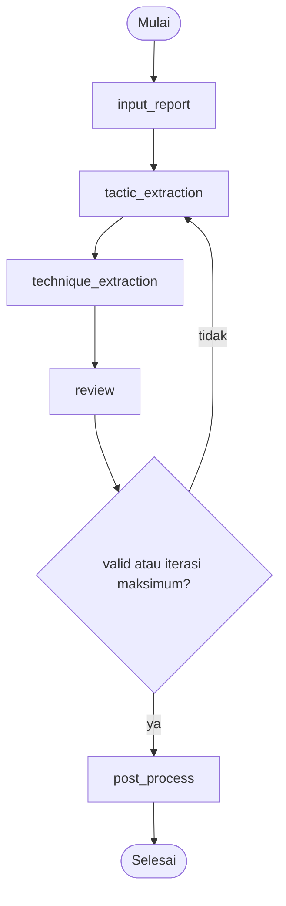
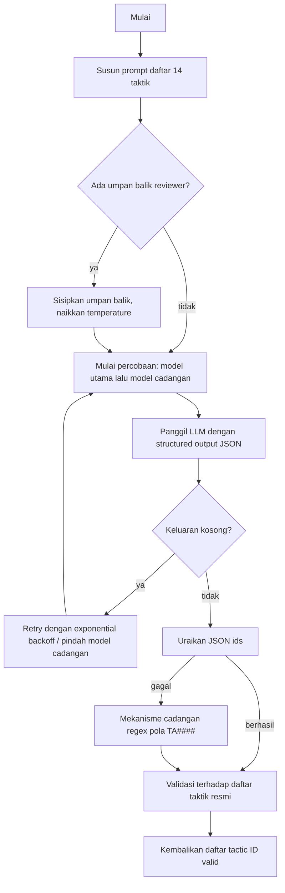
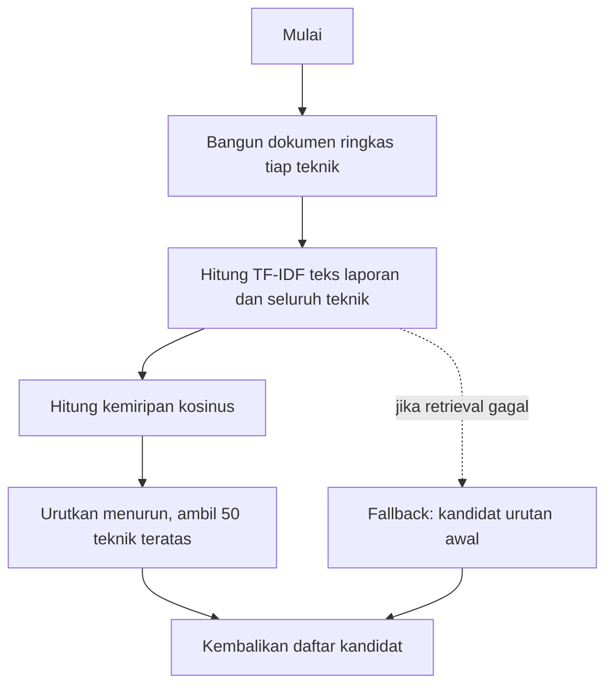
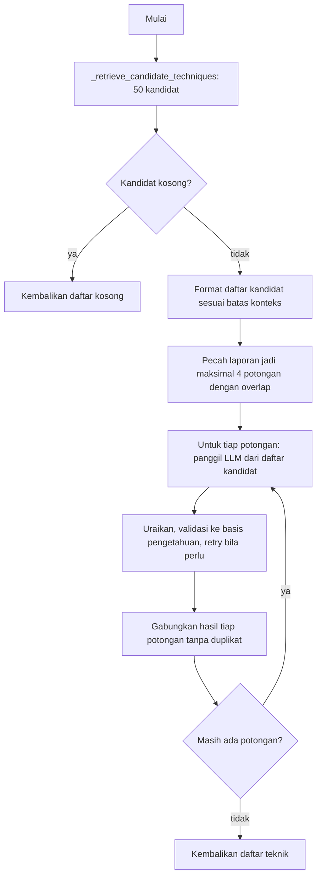
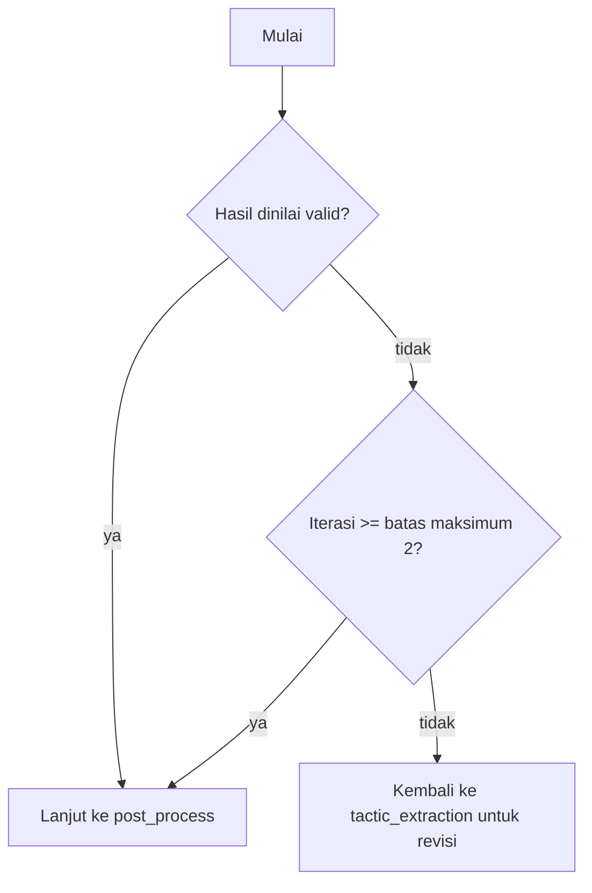
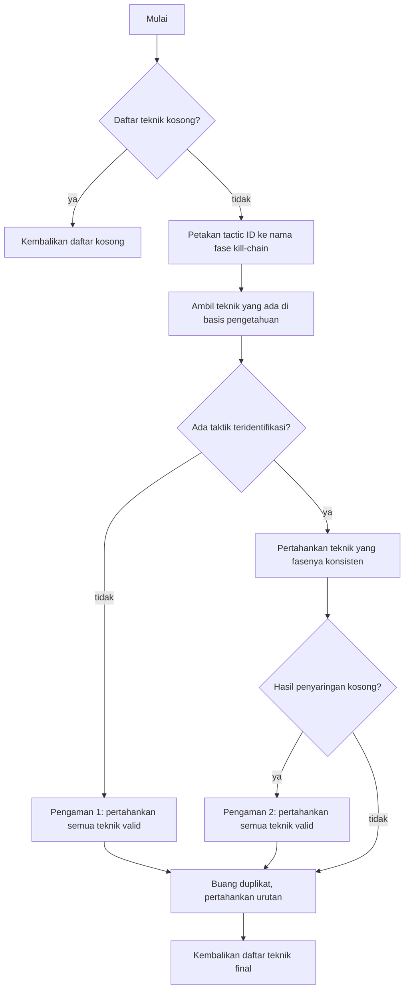

# IV.2.4 Implementasi Pipeline

> Catatan untuk penulis:
> - Penomoran Gambar/Tabel di bawah bersifat sementara — sesuaikan dengan urutan di babmu.
> - Diagram alir ditulis dalam format Mermaid agar mudah dirender saat penyusunan. Untuk laporan final, ekspor tiap diagram menjadi gambar (PNG/SVG) lalu sisipkan sebagai "Gambar 4.x" dengan caption.
> - Flowchart fungsi pendukung (helper) yang tidak ditampilkan di sini diletakkan di Lampiran dan dirujuk dari teks.

---

Pipeline diimplementasikan sebagai graf LangGraph dengan lima node utama yang dieksekusi secara berurutan, yaitu `input_report`, `tactic_extraction`, `technique_extraction`, `review`, dan `post_process`. Setiap node membaca dan memperbarui satu objek state bersama, sehingga keluaran sebuah node menjadi masukan bagi node berikutnya. Setelah node `review` terdapat sebuah percabangan berkondisi yang menentukan apakah proses dilanjutkan ke pasca-pemrosesan atau dikembalikan ke tahap ekstraksi taktik untuk diperbaiki. Gambaran menyeluruh urutan eksekusi node beserta jalur revisinya ditunjukkan pada Gambar 4.4, sedangkan ringkasan fungsi dan keluaran tiap node disajikan pada Tabel 4.3.

**Gambar 4.4** Diagram alir pipeline secara keseluruhan

**Tabel 4.3** Tahapan Eksekusi Pipeline

| Node | Fungsi | Keluaran |
|---|---|---|
| input_report | Penyiapan data laporan dan label. | report_text, ground_truth |
| tactic_extraction | Identifikasi taktik oleh Tactic Agent. | tactics_identified |
| technique_extraction | Ekstraksi teknik oleh Technique Agent dengan retrieval kandidat. | techniques_raw |
| review | Penilaian konsistensi oleh Reviewer Agent (opsional). | review_is_valid, reviewer_feedback |
| post_process | Rekonsiliasi, validasi, dan pembentukan STIX secara deterministik. | predicted_techniques, stix_bundle |

Penjelasan rinci tiap tahap beserta diagram alir fungsi utamanya diuraikan pada bagian-bagian berikut.

## a. Penyiapan Masukan (input_report)

Node pertama bertugas menyiapkan data laporan sebelum diproses oleh agen. Node ini membaca objek laporan dari state, mengambil teks laporan beserta label acuan (ground truth), lalu menuliskannya kembali ke state agar dapat digunakan node berikutnya. Karena bersifat penyiapan data sederhana tanpa percabangan, diagram alir fungsi ini disertakan pada Lampiran.

## b. Identifikasi Taktik (Tactic Agent)

Tahap identifikasi taktik diimplementasikan pada fungsi `identify_tactics` di dalam Tactic Agent. Agen ini diberi daftar tertutup berisi 14 taktik ATT&CK Enterprise dan diinstruksikan untuk memilih hanya dari daftar tersebut. Diagram alir fungsi ini ditunjukkan pada Gambar 4.5.

**Gambar 4.5** Diagram alir fungsi identify_tactics (Tactic Agent)

Sebagaimana terlihat pada Gambar 4.5, untuk menjamin format keluaran, permintaan ke model menggunakan structured output berupa skema JSON yang memaksa keluaran berbentuk objek dengan field `ids` berisi daftar identitas taktik. Karena model Qwen3 bersifat hybrid reasoning, mode penalaran (thinking) dinonaktifkan agar anggaran token tidak habis untuk proses penalaran sehingga keluaran JSON tetap dihasilkan; sisa blok penalaran yang masih muncul akan dibersihkan secara otomatis. Apabila penguraian JSON gagal, sistem beralih ke mekanisme cadangan berbasis ekspresi reguler untuk mengenali pola identitas taktik (TA####). Setiap identitas yang dihasilkan kemudian divalidasi terhadap daftar taktik resmi agar hanya taktik yang sah yang diteruskan. Seluruh pemanggilan dibungkus dengan mekanisme percobaan ulang berjenjang (retry) disertai exponential backoff serta dukungan model cadangan, sehingga kegagalan sementara pada server LLM tidak langsung menggagalkan pemrosesan laporan.

## c. Ekstraksi Teknik (Technique Agent)

Tahap ekstraksi teknik diimplementasikan pada fungsi `extract_techniques` di dalam Technique Agent dan merupakan tahap paling kompleks karena ruang teknik ATT&CK sangat besar (ratusan teknik). Untuk mengatasinya digunakan pendekatan berbasis retrieval yang mempersempit ruang pencarian sebelum melibatkan LLM. Proses retrieval kandidat ini diimplementasikan pada fungsi `_retrieve_candidate_techniques`, dengan diagram alir pada Gambar 4.6, sedangkan alur ekstraksi teknik secara keseluruhan ditunjukkan pada Gambar 4.7.

**Gambar 4.6** Diagram alir retrieval kandidat teknik (_retrieve_candidate_techniques)

**Gambar 4.7** Diagram alir fungsi extract_techniques (Technique Agent)

Sebagaimana ditunjukkan pada Gambar 4.6, mula-mula sistem membangun dokumen ringkas untuk setiap teknik, lalu menghitung kemiripan kosinus berbasis TF-IDF antara teks laporan dan seluruh teknik, dan mengambil 50 teknik kandidat dengan skor tertinggi. Nilai 50 dipilih secara sengaja karena jumlah kandidat yang terlalu kecil membuat teknik yang benar berisiko tidak masuk peringkat teratas sehingga menurunkan recall. Selanjutnya, sesuai Gambar 4.7, laporan yang panjang dipecah menjadi maksimal empat potongan dengan sedikit tumpang tindih agar teknik yang berada di bagian akhir laporan tidak hilang akibat pemotongan, dan hasil dari setiap potongan digabungkan tanpa duplikasi. Prompt yang dikirim ke model hanya memuat daftar kandidat hasil retrieval, dan model dilarang menghasilkan identitas teknik di luar daftar tersebut. Mekanisme penguraian keluaran, validasi terhadap basis pengetahuan, serta percobaan ulang mengikuti pola yang sama dengan Tactic Agent pada Gambar 4.5.

## d. Review dan Percabangan Revisi (Reviewer Agent)

Tahap review dijalankan oleh Reviewer Agent yang menerima kutipan laporan beserta ringkasan taktik dan teknik, lalu mengembalikan penilaian berupa status valid dan umpan balik perbaikan. Hasil penilaian ini menjadi dasar logika percabangan yang diimplementasikan pada fungsi `_should_revise`, sebagaimana ditunjukkan pada Gambar 4.8.

**Gambar 4.8** Diagram alir logika percabangan revisi (_should_revise)

Sebagaimana terlihat pada Gambar 4.8, apabila hasil dinilai valid, proses dilanjutkan ke pasca-pemrosesan; apabila jumlah iterasi telah mencapai batas maksimum (dua kali), proses juga tetap dilanjutkan agar tidak terjadi pengulangan tak berujung; selain itu, proses dikembalikan ke tahap ekstraksi taktik untuk diperbaiki. Pada jalur revisi, umpan balik reviewer disuntikkan ke dalam prompt agen dan temperature dinaikkan agar agen benar-benar merevisi jawabannya, sebagaimana tampak pada percabangan umpan balik di Gambar 4.5 dan Gambar 4.7. Apabila Reviewer Agent tidak diaktifkan, node `review` langsung menyatakan hasil valid sehingga umpan balik dilewati. Dengan demikian, Reviewer Agent merupakan komponen opsional yang dapat dihidupkan atau dimatikan sesuai kebutuhan eksperimen.

## e. Pasca-pemrosesan (Deterministik)

Tahap pasca-pemrosesan dijalankan secara deterministik tanpa pemanggilan LLM melalui tiga langkah berurutan, yaitu rekonsiliasi, validasi, dan pembentukan STIX. Langkah rekonsiliasi yang menjadi inti tahap ini diimplementasikan pada fungsi `reconcile_results`, dengan diagram alir pada Gambar 4.9.

**Gambar 4.9** Diagram alir fungsi reconcile_results

Sebagaimana ditunjukkan pada Gambar 4.9, langkah pertama adalah rekonsiliasi yang menyaring teknik mentah terhadap basis pengetahuan dan mencocokkan konsistensinya dengan taktik yang teridentifikasi melalui pemetaan identitas taktik ke nama fase kill-chain. Pada langkah ini diterapkan dua pengaman: apabila tidak ada taktik yang teridentifikasi maka seluruh teknik valid dipertahankan, dan apabila penyaringan konsistensi justru menghapus seluruh teknik valid maka hasil tidak dikosongkan agar recall tidak hilang sepenuhnya. Langkah kedua adalah validasi (fungsi `validate_techniques`) yang memisahkan teknik menjadi valid dan tidak valid berdasarkan keberadaannya pada basis pengetahuan ATT&CK, dan hanya teknik valid yang diteruskan. Langkah ketiga adalah pembentukan STIX (fungsi `build_stix_bundle`) yang mengonversi setiap teknik final menjadi objek AttackPattern STIX 2.1 lengkap dengan referensi eksternal ke laman MITRE ATT&CK dan fase kill-chain-nya, lalu merangkainya menjadi satu bundle. Keluaran akhir pipeline berupa daftar teknik prediksi (`predicted_techniques`) beserta bundle STIX 2.1 yang dihasilkan.

Diagram alir untuk fungsi-fungsi pendukung lain, seperti penyiapan masukan, pemuatan dataset, pemuatan basis pengetahuan ATT&CK, serta fungsi validasi dan pembentukan STIX secara rinci, disajikan pada Lampiran untuk menjaga fokus pembahasan pada alur utama pipeline.
