# Implementasi: Diagram Alir & Penjelasan Fungsi Utama per Modul

> Catatan penulis:
> - Setiap modul diwakili oleh satu fungsi utamanya saja agar pembahasan ringkas dan fokus.
> - Penomoran Gambar bersifat sementara; sesuaikan dengan urutan di babmu.
> - Diagram ditulis dalam format Mermaid; untuk laporan final, ekspor menjadi gambar lalu sisipkan sebagai "Gambar 4.x".
> - Saran penempatan: modul inti pipeline (poin 1–11) di sub-bab Implementasi Pipeline; modul keluaran & antarmuka (poin 12–15) di Lampiran atau bagian Demonstration.

---

## 1. Program Utama — `main.py` : `main()`

Fungsi `main` merupakan titik masuk sistem yang merangkai keseluruhan alur eksekusi. Setelah memastikan konfigurasi valid melalui `validate_setup`, fungsi ini memuat dataset laporan CTI dan basis pengetahuan ATT&CK, menginisialisasi agen, lalu memproses setiap laporan melalui `process_report`. Terdapat percabangan `REVIEWER_ENABLE` yang menegaskan bahwa Reviewer Agent bersifat opsional. Hasil pemrosesan kemudian dievaluasi, dicetak, dan disimpan. Alur fungsi ini ditunjukkan pada Gambar 4.x.

**Gambar 4.x** Diagram alir fungsi main

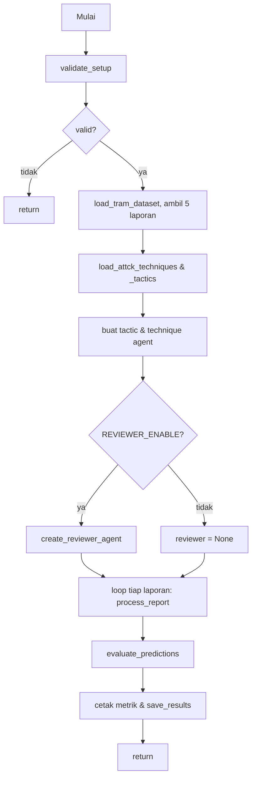

## 2. Pemuatan Dataset — `data_loader.py` : `load_tram_dataset()`

Fungsi `load_tram_dataset` membaca seluruh berkas dataset TRAM II dari sebuah direktori. Mula-mula seluruh berkas PDF dikonversi otomatis menjadi JSON, lalu setiap berkas `.json`/`.mjson` dibaca untuk diekstraksi teks laporan dan label teknik acuannya. Berkas dengan JSON tidak valid dilewati, dan hanya laporan yang memiliki teks yang dimasukkan ke daftar keluaran. Alur fungsi ini ditunjukkan pada Gambar 4.x.

**Gambar 4.x** Diagram alir fungsi load_tram_dataset

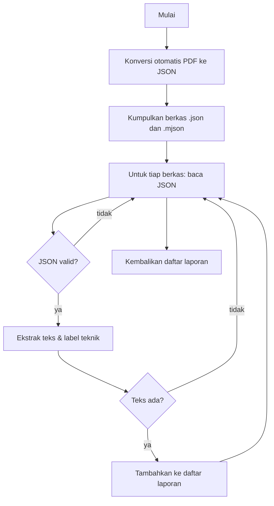

## 3. Pemuatan Basis Pengetahuan — `attck_loader.py` : `load_attck_techniques()`

Fungsi `load_attck_techniques` membangun basis pengetahuan teknik ATT&CK dari berkas MITRE CTI. Fungsi ini menelusuri seluruh objek, menyaring hanya objek bertipe attack-pattern yang tidak usang, mengambil identitas teknik dan taktik (fase kill-chain) dari referensi eksternalnya, lalu menyusunnya menjadi sebuah dictionary. Apabila sebuah teknik muncul lebih dari sekali, datanya digabungkan. Alur fungsi ini ditunjukkan pada Gambar 4.x.

**Gambar 4.x** Diagram alir fungsi load_attck_techniques

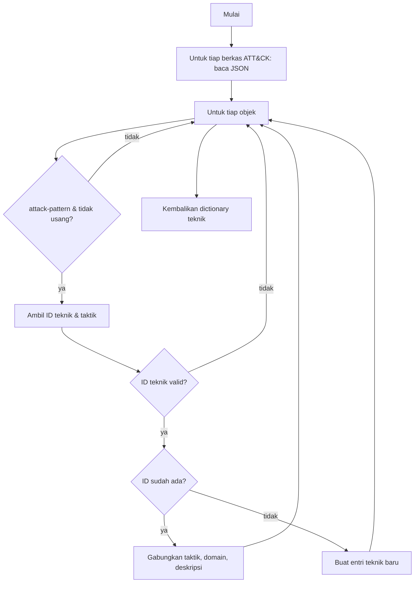

## 4. Identifikasi Taktik — `tactic_agent.py` : `identify_tactics()`

Fungsi `identify_tactics` memetakan teks laporan ke taktik ATT&CK dari daftar tertutup 14 taktik Enterprise. Permintaan ke model menggunakan structured output JSON, dengan mode penalaran model dinonaktifkan agar keluaran tetap dihasilkan. Apabila penguraian JSON gagal, digunakan mekanisme cadangan berbasis ekspresi reguler. Setiap pemanggilan dibungkus retry berjenjang dengan exponential backoff dan dukungan model cadangan. Alur fungsi ini ditunjukkan pada Gambar 4.x.

**Gambar 4.x** Diagram alir fungsi identify_tactics

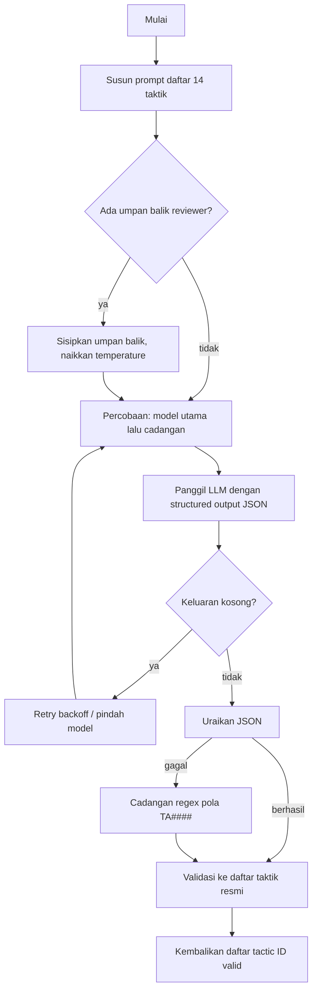

## 5. Ekstraksi Teknik — `technique_agent.py` : `extract_techniques()`

Fungsi `extract_techniques` merupakan tahap paling kompleks karena ruang teknik ATT&CK sangat besar. Untuk mengatasinya, sistem terlebih dahulu mempersempit kandidat melalui retrieval TF-IDF (50 teknik teratas), lalu memecah laporan panjang menjadi beberapa potongan dengan tumpang tindih agar tidak ada teknik yang hilang. Model hanya boleh memilih dari daftar kandidat, dan hasil tiap potongan digabungkan tanpa duplikasi. Alur fungsi ini ditunjukkan pada Gambar 4.x.

**Gambar 4.x** Diagram alir fungsi extract_techniques

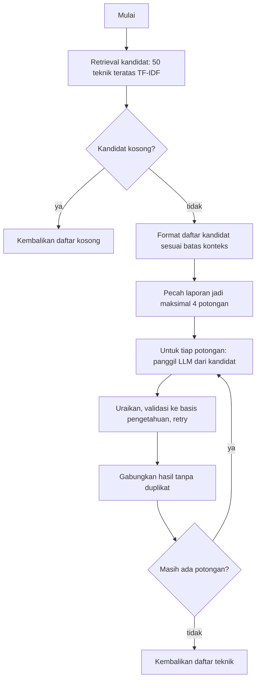

## 6. Review Konsistensi — `reviewer_agent.py` : `review_tactics_and_techniques()`

Fungsi `review_tactics_and_techniques` menilai apakah taktik dan teknik yang diperoleh konsisten dengan teks laporan. Fungsi ini menyusun ringkasan taktik dan teknik, mengirimkannya ke model bersama kutipan laporan, lalu mengembalikan penilaian berupa status valid beserta umpan balik. Sama seperti agen lain, terdapat mekanisme cadangan penguraian dan retry. Alur fungsi ini ditunjukkan pada Gambar 4.x.

**Gambar 4.x** Diagram alir fungsi review_tactics_and_techniques

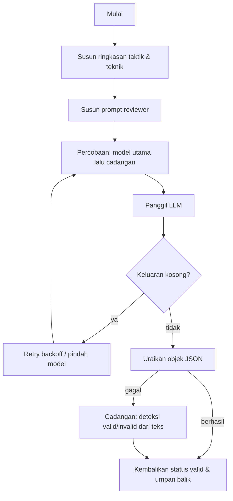

## 7. Orkestrasi Pipeline — `orchestrator.py` : `process_report()`

Fungsi `process_report` memproses satu laporan melalui keseluruhan pipeline LangGraph. Fungsi ini menyiapkan state awal, lalu menjalankan graf yang merangkai node `input_report`, `tactic_extraction`, `technique_extraction`, `review`, dan `post_process`, termasuk percabangan revisi setelah node review. Keluarannya berupa teknik prediksi, taktik teridentifikasi, dan bundle STIX. Alur fungsi ini ditunjukkan pada Gambar 4.x.

**Gambar 4.x** Diagram alir fungsi process_report

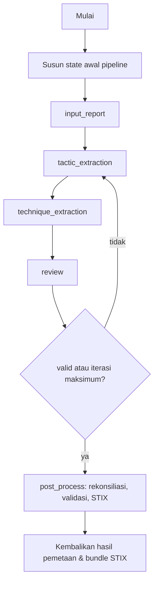

## 8. Rekonsiliasi — `reconciler.py` : `reconcile_results()`

Fungsi `reconcile_results` menyaring teknik mentah agar konsisten dengan taktik yang teridentifikasi, dengan memetakan identitas taktik ke nama fase kill-chain. Terdapat dua pengaman penting: apabila tidak ada taktik teridentifikasi, seluruh teknik valid dipertahankan; dan apabila penyaringan justru menghapus seluruh teknik valid, hasil tidak dikosongkan agar recall tidak hilang. Alur fungsi ini ditunjukkan pada Gambar 4.x.

**Gambar 4.x** Diagram alir fungsi reconcile_results

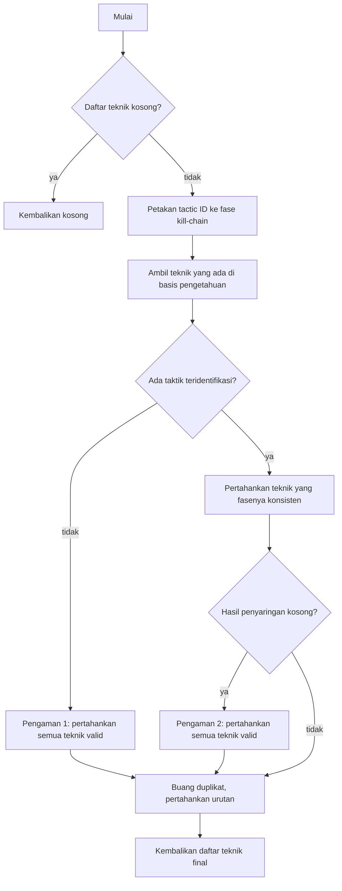

## 9. Validasi — `validator.py` : `validate_techniques()`

Fungsi `validate_techniques` memverifikasi setiap teknik hasil rekonsiliasi terhadap basis pengetahuan ATT&CK. Teknik dipisahkan menjadi valid (terdapat di basis pengetahuan) dan tidak valid, dan hanya teknik valid yang diteruskan ke tahap berikutnya. Alur fungsi ini ditunjukkan pada Gambar 4.x.

**Gambar 4.x** Diagram alir fungsi validate_techniques

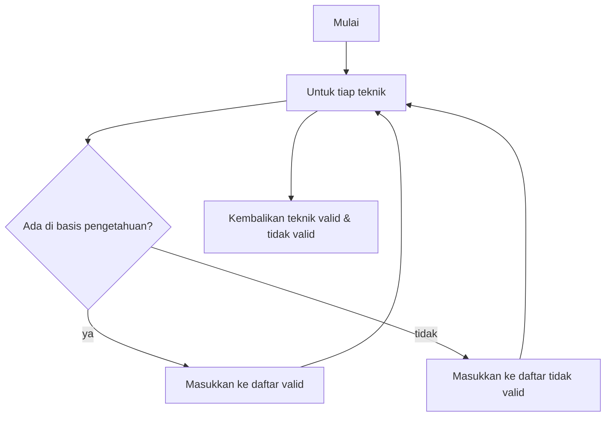

## 10. Pembentukan STIX — `stix_builder.py` : `build_stix_bundle()`

Fungsi `build_stix_bundle` mengonversi daftar teknik final menjadi keluaran STIX 2.1. Setiap teknik diubah menjadi objek AttackPattern lengkap dengan referensi eksternal ke laman MITRE ATT&CK dan fase kill-chain-nya, lalu seluruh objek dirangkai menjadi satu bundle. Alur fungsi ini ditunjukkan pada Gambar 4.x.

**Gambar 4.x** Diagram alir fungsi build_stix_bundle

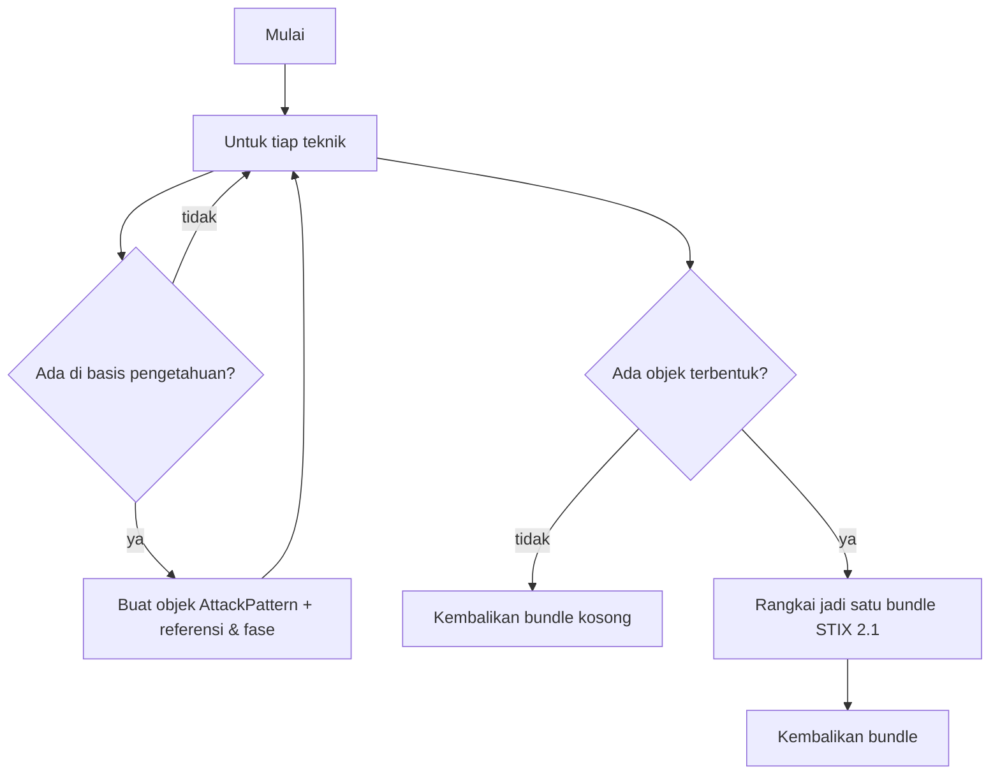

## 11. Evaluasi — `evaluator.py` : `evaluate_predictions()`

Fungsi `evaluate_predictions` menghitung metrik kinerja sistem dengan membandingkan teknik prediksi terhadap label acuan. Perhitungan dilakukan dalam dua mode: exact (identitas persis termasuk sub-teknik) dan base-technique (dinormalisasi ke teknik induk) agar ketidakcocokan granularitas sub-teknik tidak menghukum hasil secara berlebihan. Alur fungsi ini ditunjukkan pada Gambar 4.x.

**Gambar 4.x** Diagram alir fungsi evaluate_predictions

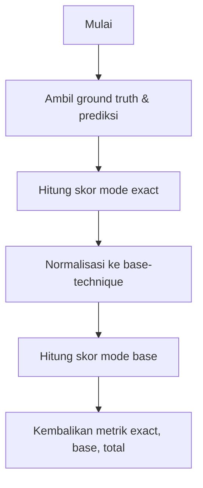

---

## Modul Keluaran & Antarmuka (disarankan ke Lampiran / Demonstration)

## 12. Penelusuran Bukti — `evidence.py` : `build_evidence_map()`

Fungsi `build_evidence_map` mencari kalimat rujukan (evidence) untuk tiap taktik dan teknik yang terpetakan menggunakan TF-IDF, tanpa pemanggilan LLM tambahan. Hasilnya dipakai untuk menampilkan dasar setiap pemetaan pada laporan PDF. Alur fungsi ini ditunjukkan pada Gambar 4.x.

**Gambar 4.x** Diagram alir fungsi build_evidence_map

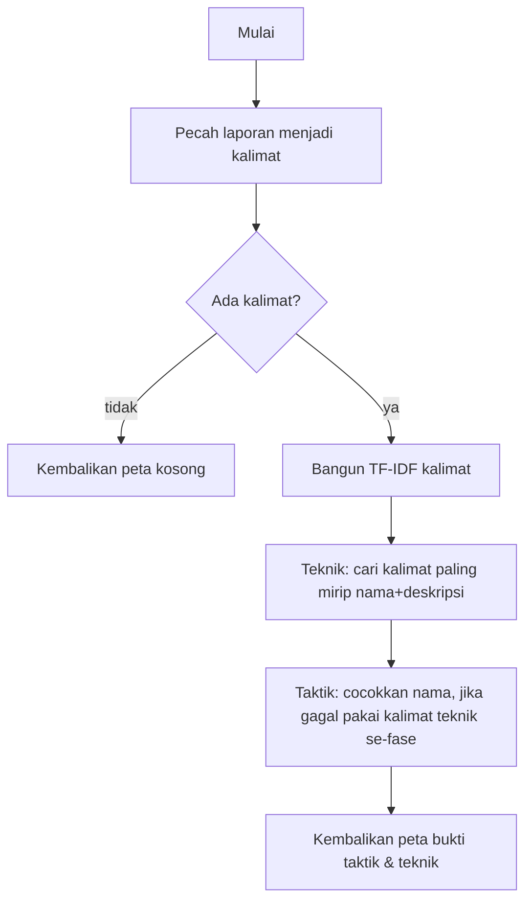

## 13. Laporan PDF — `report_builder.py` : `build_pdf_report()`

Fungsi `build_pdf_report` menyusun dokumen PDF hasil pemetaan, berisi metadata laporan, tabel taktik dan teknik beserta kalimat rujukannya, serta ringkasan STIX. Alur fungsi ini ditunjukkan pada Gambar 4.x.

**Gambar 4.x** Diagram alir fungsi build_pdf_report

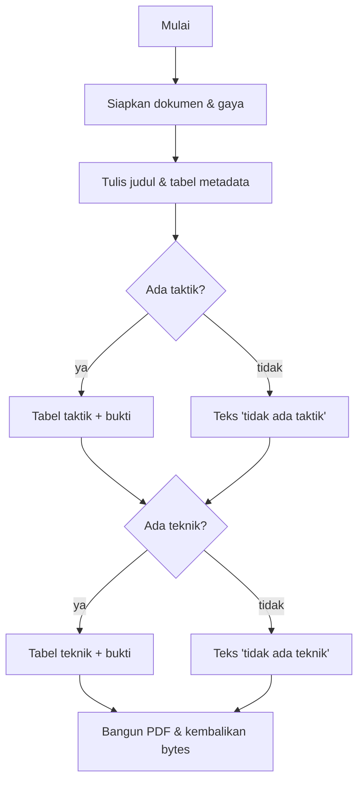

## 14. Antarmuka Web — `web_app.py` : `process()` dan `_run_job()`

Endpoint `process` menerima unggahan laporan, membuat sebuah job, lalu menjalankannya pada thread terpisah melalui `_run_job` agar tidak menahan server selama proses panjang. Pengguna kemudian memantau status, mengambil hasil, memvalidasinya, dan mengunduh laporan PDF. Inti pemetaan tetap dilakukan oleh `process_report` yang sama dengan pipeline. Alur ringkas ditunjukkan pada Gambar 4.x.

**Gambar 4.x** Diagram alir layanan pemrosesan web (process & _run_job)

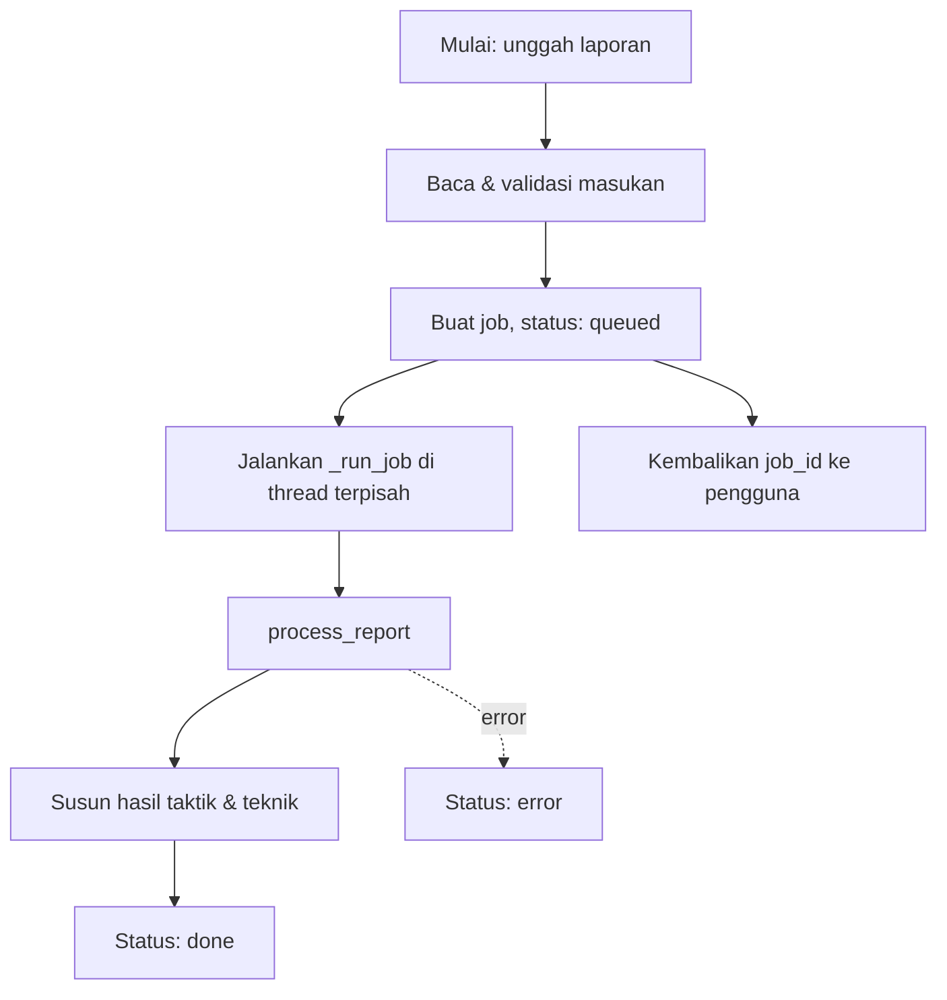

## 15. Laporan Excel — `build_excel_report.py` : `main()`

Fungsi `main` pada modul ini menghasilkan laporan evaluasi dalam berkas Excel dari berkas hasil prediksi. Workbook yang dibentuk berisi empat lembar: ringkasan metrik, hasil per laporan, taktik per laporan, dan distribusi taktik. Alur fungsi ini ditunjukkan pada Gambar 4.x.

**Gambar 4.x** Diagram alir fungsi main (build_excel_report)

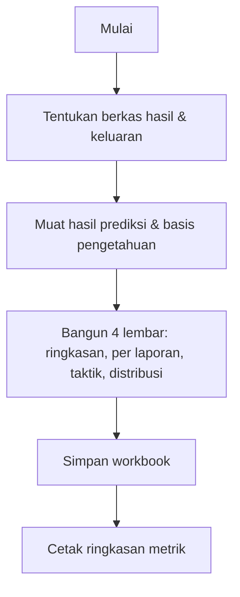

---

## Catatan modul pendukung lain
Modul `pdf_to_json_converter.py` (konversi PDF ke JSON sebagai alat bantu), serta `evaluate_run.py` dan `run_full_pipeline.py` (skrip alternatif untuk menjalankan dan mengevaluasi pipeline pada seluruh dataset) memiliki alur yang serupa dengan `main()` dan tidak perlu digambarkan terpisah pada badan laporan. Apabila diperlukan, diagram alirnya dapat disertakan pada Lampiran.
